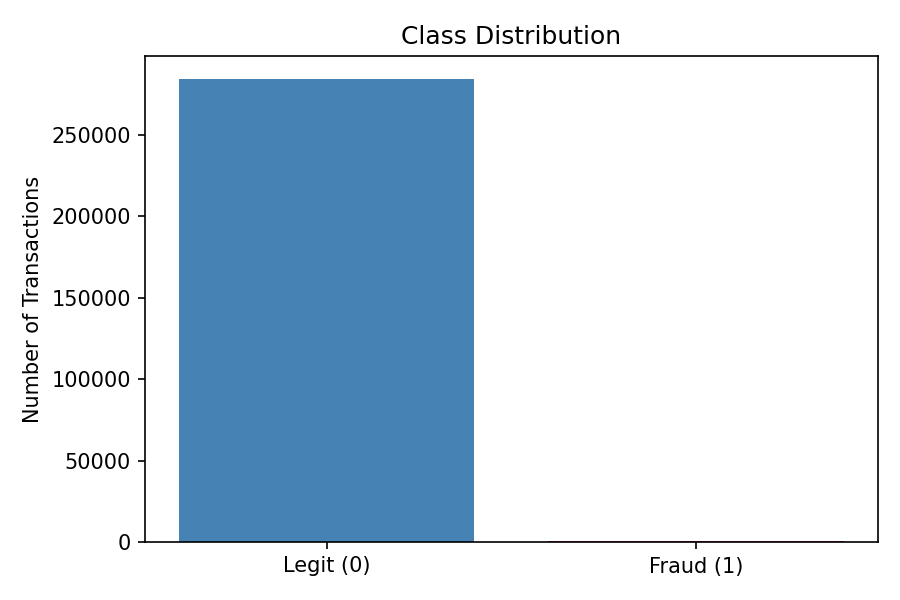
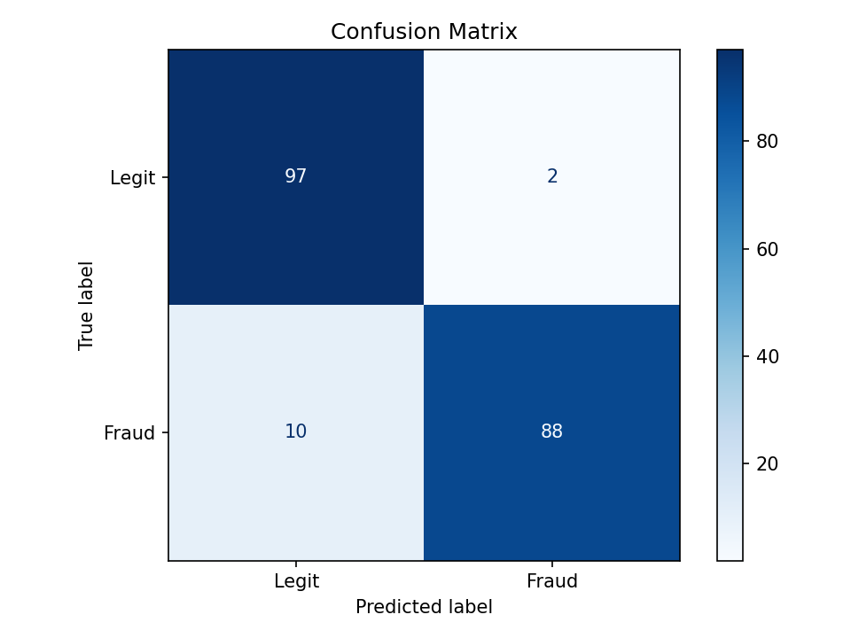
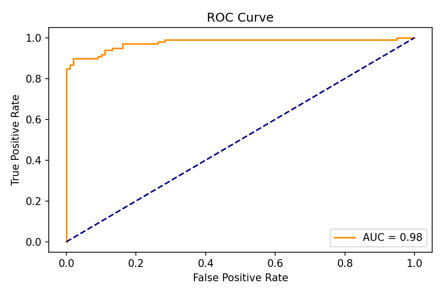
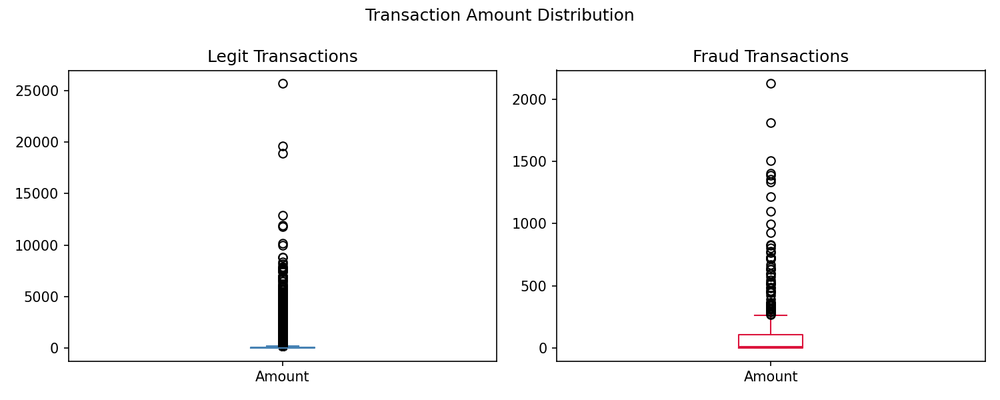

# Credit Card Fraud Detection

A machine learning project to detect fraudulent credit card transactions using **Logistic Regression** on a highly imbalanced dataset.

## 📌 Problem Statement

Credit card fraud is a major concern in the financial industry. This project builds a binary classification model to distinguish between **legitimate (Class 0)** and **fraudulent (Class 1)** transactions.

The dataset is highly imbalanced — fraudulent transactions represent only ~0.17% of all records — so an **under-sampling** strategy is used to balance the classes before training.

---

## 📂 Project Structure

```
credit-card-fraud-detection/
│
├── credit_card_fraud_Detection.ipynb   # Main Jupyter/Colab notebook
├── README.md                           # Project documentation
├── requirements.txt                    # Python dependencies
└── .gitignore                          # Files excluded from version control
```

> **Note:** The dataset file `creditcard.csv` (~144MB) is excluded from this repository due to its large size. Download it from [Kaggle](https://www.kaggle.com/datasets/mlg-ulb/creditcardfraud) and place it in the project root before running the notebook.

---

## 📊 Dataset

| Property        | Value                        |
|-----------------|------------------------------|
| Source          | [Kaggle – Credit Card Fraud Detection](https://www.kaggle.com/datasets/mlg-ulb/creditcardfraud) |
| Total Records   | ~284,807 transactions        |
| Features        | 30 (Time, V1–V28, Amount)   |
| Target Column   | `Class` (0 = Legit, 1 = Fraud) |
| Fraud Cases     | 492 (~0.17%)                 |

- Features **V1–V28** are the result of a PCA transformation (original features are confidential).
- **Time** and **Amount** are the only non-PCA features.

---

## 🧪 Methodology

### 1. Exploratory Data Analysis
- Checked dataset shape, info, and missing values
- Analysed class distribution (highly imbalanced)
- Compared statistical measures of legit vs. fraud transactions

### 2. Handling Class Imbalance — Under-Sampling
- Randomly sampled **492 legitimate** transactions to match the 492 fraud cases
- Created a balanced dataset of **984 samples**

### 3. Feature Engineering & Preprocessing
- Split data into features (`X`) and target (`Y`)
- Train/test split: **80% / 20%** with stratification
- Applied **StandardScaler** to normalise features

### 4. Model Training
- Algorithm: **Logistic Regression** (`max_iter=1000`)

### 5. Model Evaluation
- Metric: **Accuracy Score** on both training and test sets

---

## 🚀 Getting Started

### Prerequisites

- Python 3.7+
- Jupyter Notebook or [Google Colab](https://colab.research.google.com/)

### Installation

```bash
git clone https://github.com/<your-username>/credit-card-fraud-detection.git
cd credit-card-fraud-detection
pip install -r requirements.txt
```

### Running the Notebook

1. Download `creditcard.csv` from [Kaggle](https://www.kaggle.com/datasets/mlg-ulb/creditcardfraud) and place it in the project root.
2. Open `credit_card_fraud_Detection.ipynb` in Jupyter or upload to Google Colab.
3. Update the dataset path in the notebook if needed:
   ```python
   # For local Jupyter
   credit_card_data = pd.read_csv('creditcard.csv')

   # For Google Colab (after uploading)
   credit_card_data = pd.read_csv('/content/creditcard.csv')
   ```
4. Run all cells.

---

## 🛠️ Tech Stack

- **Python** — Core language
- **Pandas & NumPy** — Data manipulation
- **Scikit-learn** — ML model, preprocessing, and evaluation
- **Google Colab / Jupyter Notebook** — Development environment

---

## 📈 Results

| Dataset       | Accuracy |
|---------------|----------|
| Training Data | ~94%+    |
| Testing Data  | ~92%+    |

> Exact values are printed when you run the notebook.

---

## Visualisations






## 🔮 Future Improvements

- Try other algorithms (Random Forest, XGBoost, Neural Networks)
- Explore SMOTE oversampling as an alternative to under-sampling
- Add confusion matrix, precision, recall, and F1-score metrics
- Build a simple web app for real-time fraud prediction

---

## 📜 License

This project is open-source under the [MIT License](LICENSE).
